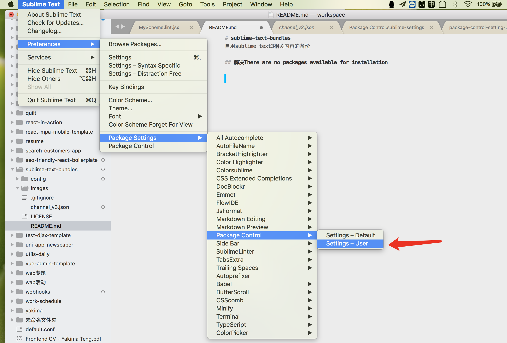

# sublime-text-bundles
自用sublime text3相关内容的备份

## 解决There are no packages available for installation

Then add setting based on content like what is in [./config/package-control-setting-user.json](./config/package-control-setting-user.json).
